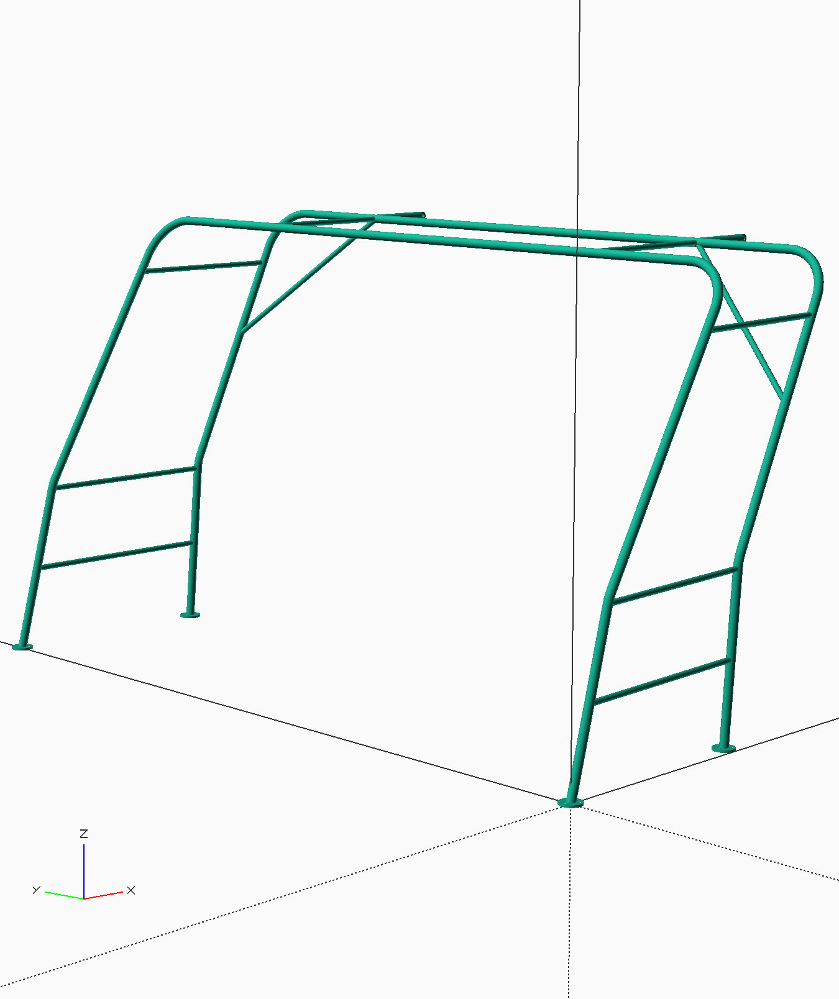

# solar_arch

Parametric CAD model of a freestanding arched steel-tube frame for mounting
solar panels, with a davit hook for lifting the assembled structure into place.

The design is **code-first**: a single Python script (SolidPython2 + BOSL2)
derives every member length from a small set of dimension constants and emits
OpenSCAD source, which is rendered to STL/PNG.



## Key dimensions

All dimensions in millimetres, set as constants at the top of `solar_arch.py`.

| Parameter | Value |
|---|---|
| Main tube (arches, davit) | Ø40 mm OD / Ø37 mm ID |
| Bracing tube (rails, cross brace) | Ø25.4 mm OD / Ø24 mm ID (1" tube) |
| Bend radius | 200 mm |
| Arch height | 2000 mm |
| Rail height | 750 mm |
| Front arch width | 3500 mm |
| Back arch width | 3400 mm |
| Base depth | 1000 mm |
| Stantion lean | front 15°, back 5° |
| Arch bend angle | front 15°, back 20° |
| Feet | Ø100 mm × 8 mm, 3 × Ø8.5 mm bolt holes, Ø37 mm centre bore |
| Davit | 300 mm tube, 3 mm end cap, loop with Ø20 mm hole |

The generator prints the derived geometry on each run, e.g.:

```
Height= 2000.0
Top depth= 720.4
Top setback= 914.8 (distance from perpendicular at base front)
Top-back setback= 635.2 (distance from perpendicular at base back)
```

## Files

| File | Role |
|---|---|
| `solar_arch.py` | **Source of truth** — parametric generator (SolidPython2 + BOSL2) |
| `solar_arch.scad` | Generated full assembly (both arch frames mirrored) |
| `loop.scad` | Generated davit loop sub-part (3D-printable) |
| `foot.scad` | Generated foot sub-part (3D-printable) |
| `solar_arch.stl` | Exported mesh (ASCII, ~20 MB) |
| `solar_arch.png` | Render preview |
| `LICENSE` | GPL-3.0 |

## Pipeline

```
solar_arch.py ──► solar_arch.scad (+ loop.scad, foot.scad) ──► OpenSCAD ──► solar_arch.stl / solar_arch.png
```

## Prerequisites

- Python 3.13 (tested)
- `pip install -r requirements.txt` — installs SolidPython2 2.1.2; the
  required BOSL2 library is bundled inside it
- [OpenSCAD](https://openscad.org/) — separate install, not a pip package

## Usage

Regenerate the OpenSCAD source:

```sh
python solar_arch.py
```

Render the mesh and preview (run inside OpenSCAD or from the CLI):

```sh
openscad -o solar_arch.stl solar_arch.scad
openscad -o solar_arch.png --autocenter --viewall solar_arch.scad
```

To change the design, edit the constants at the top of `solar_arch.py` and
re-run — member lengths, bend positions, and support spans are all derived,
and the script asserts that both arches reach the same height.

## Notes

- The generated `.scad` files embed **absolute include paths** to the BOSL2
  copy installed with SolidPython2 on the machine that generated them. After
  cloning on a new machine or environment, always regenerate via
  `python solar_arch.py` rather than using the checked-in `.scad` files
  directly.
- The committed STL is ASCII. If you need a smaller file, export binary STL
  from OpenSCAD (~10× smaller).
- `loop.scad` and `foot.scad` are generated on every run and are print-ready.

## License

GPL-3.0 — see [LICENSE](LICENSE).
